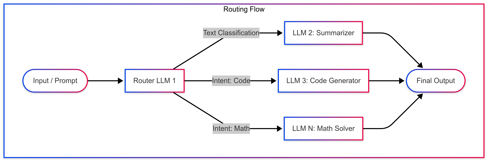
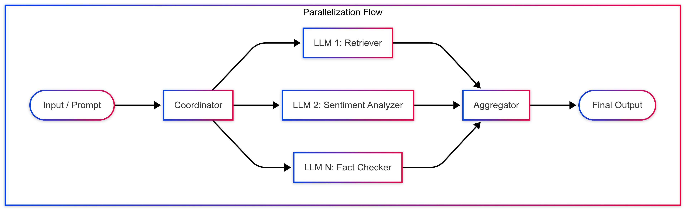
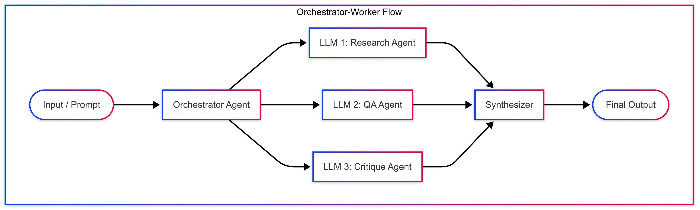
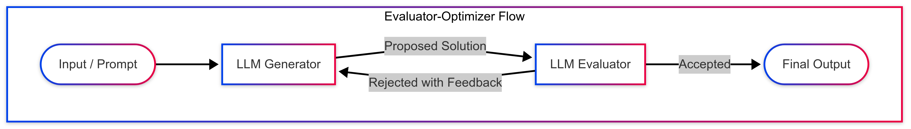
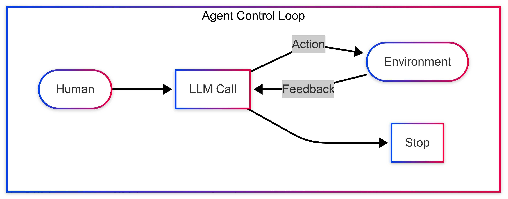

# Chapter 2: Agentic Systems Overview

This chapter introduces the foundational concepts behind agentic systems — what they are, what makes them effective, and the common design patterns used in their construction.

Much of this thinking is inspired by [Ed Donner's Agentic AI Engineering Course](https://edwarddonner.com/2025/04/21/the-complete-agentic-ai-engineering-course).

> **AI Agents are programs where LLM outputs control the workflow.**

Agentic systems typically involve capabilities such as:

- Multiple LLM calls
- LLMs that can call tools or external functions
- An interactive environment where LLMs can act and observe
- A planner to coordinate and sequence actions
- Varying degrees of autonomy

---

## Categories of Agentic Systems

Agentic systems can be loosely grouped into two major categories based on how control and orchestration are handled:

### 1. **Workflow-Based Agentic Systems**

These are systems where LLMs and tools are orchestrated through predefined, deterministic code paths.  
They're often built using frameworks or scripts that guide the flow step-by-step, using the LLM to generate content or complete tasks within a fixed structure.

Think of them as **LLM-enhanced workflows** - useful when you need reliability and tight control.

#### Workflow design patterns

- Prompt Chaining (Sequential Flow)
- Routing Pattern
- Parallelization Pattern
- Orchestrator-Worker Pattern
- Evaluator-Optimizer (Self-Improving Loop)

##### 🧩 1. Prompt Chaining (Sequential Flow)

> 🔗 **Simple but rigid**: Great when your steps never change — but hard to adapt if the workflow needs more flexibility later.

###### 🧠 What it is:

A linear pipeline where each LLM performs one step and passes its result to the next. 
Each step builds on the previous - a pure, deterministic chain of prompts.

###### 🔀 Diagram

###### ✅ When to use:

- For simple, deterministic multi-step tasks.
- When modularity and transformation steps are clearly ordered.
- When no coordination or decision-making is needed.

###### 🔧 Real-World Examples:

- **Document Processing Pipeline**: `Step 1: OCR → Step 2: Summarize → Step 3: Classify topic`
- **Content Generation**: `Step 1: Generate idea → Step 2: Expand into outline → Step 3: Write blog post`
- **Data Cleaning**: `Step 1: Normalize values → Step 2: Detect anomalies → Step 3: Flag rows`

##### 🧩 2. Routing Pattern

> 🚦 **Smart dispatching**: Like an intent-aware traffic controller — efficient when only one route needs to be taken at a time.

###### 🧠 What it is:

A decision-making step routes the input to one of several specialized LLMs based on content or intent.

###### 🔀 Diagram

###### ✅ When to use:

- When tasks or input types vary widely.
- For intent classification, fallback logic, or skill-based delegation.
- When only one LLM should be triggered at a time.

###### 🔧 Real-World Examples:

- **Customer Service Agent**: Router decides if the question is about billing, tech support, or account info → routes accordingly.
- **Tool Selector Agent**: Routes to Wolfram, SQL agent, or web search based on prompt type.
- **Prompt Router in LangChain**: Dynamically routes between GPT-4 and Claude depending on context or cost.

##### 🧩 3. Parallelization Pattern

> 🧠 **Divide and conquer**: Let multiple agents reason simultaneously, then bring it all together into one powerful result.

###### 🧠 What it is:

The input is split into **parallel subtasks**, sent to multiple agents/LLMs simultaneously, and results are merged by an aggregator.

###### 🔀 Diagram

###### ✅ When to use:

- When subtasks are independent.
- When latency or scalability matters.
- For ensembling diverse views on the same input.

###### 🔧 Real-World Examples:

- **Insight Aggregator Agent**: One LLM summarizes news, another gathers tweets, another scans forums → aggregator builds full market snapshot.
- **RAG Agent with Voting**: Retrieve docs → run answers in parallel → aggregator ranks or fuses.
- **Parallel Evaluators**: Run multiple critique agents in parallel (style, logic, facts) before final synthesis.

##### 🧩 4. Orchestrator-Worker Pattern

> 🎭 **Agent collaboration at its best**: Agents take on well-defined roles under an orchestrator’s guidance — ideal for structured teamwork.

###### 🧠 What it is:

An intelligent **Orchestrator agent** coordinates multiple worker agents (LLMs), delegates subtasks, and a **Synthesizer** combines the results.

###### 🔀 Diagram

###### ✅ When to use:

- When task planning, dependency handling, or multi-role collaboration is needed.
- When workers are specialized, but interdependent.
- When the flow is agent-led rather than strictly rule-based.

###### 🔧 Real-World Examples:

**Multi-Agent Team (CrewAI-style)**: Researcher, Writer, Reviewer agents collaborate under a manager.
**Task Planning Agent**: Orchestrator breaks a goal into subtasks and assigns them in sequence or parallel.
**LangGraph App**: Complex graph where orchestrator routes agents based on memory + state.

##### 🧩 5. Evaluator-Optimizer (Self-Improving Loop)

> 🔁 Fail fast, improve faster: Perfect when you want to build agents that get better with each iteration through reflection or testing.

###### 🧠 What it is:

A loop where the **Generator** proposes a solution and the **Evaluator** accepts or sends it back with feedback.

###### 🔀 Diagram

###### ✅ When to use:

- When you want iterative refinement.
- When quality checking, safety, or standards must be enforced.
- When building self-correcting or auto-evolving agents.

###### 🔧 Real-World Examples:

- **Autogen-style Loop**: Generator writes code → Evaluator runs/test/checks logic → Generator retries with improvements.
- **Prompt Engineer Agent**: Generates prompt → Evaluator runs test cases → If failed, regenerate prompt.
- **AI Writing Assistant**: Writer agent creates content → Reviewer agent critiques → Writer updates until approved.

### 2. **LLM-Based (Autonomous) Agentic Systems**

These systems allow the LLM to dynamically control its own process - selecting tools, sequencing actions, and deciding how to achieve a goal in real-time.

They typically involve:

- Goal-setting and subtask planning.
- Repeated reasoning loops (think: ReAct, CoT).
- Memory or state tracking across steps.

These agents behave more like **autonomous collaborators**, exploring different paths to achieve complex tasks.

#### Workflow design patterns

- Agent Loop (Human-in-the-Loop or LLM-as-Agent)

##### 🧩 Agent Loop (Human-in-the-Loop or LLM-as-Agent)

> 🌀 Sense, act, adapt: The essential loop behind every agent — observe, decide, act, and refine based on feedback 
> until it’s time to stop.

###### 🧠 What it is:

This is a **fundamental agent control loop**:
An agent (LLM) observes the environment, decides on an action, receives feedback, and either continues or stops.
This is the base abstraction behind most agent frameworks — whether autonomous or human-assisted.

###### 🔀 Diagram

###### ✅ When to use:

- When building autonomous or semi-autonomous LLM agents.
- When interaction with external systems (tools, APIs, UI) is required.
- When learning or adaptation happens across time or steps.
- When the agent needs to decide: "should I keep going or stop?"

###### 🔧 Real-World Examples:

- **ReAct-style agents**: Think → Act → Observe → Repeat.
- **LangChain or CrewAI agents**: Choose next tool or response based on environment feedback.
- **Autogen agents**: Loop through message/response cycles with reflection or human review.
- **Game-playing or simulation agents**: Environment returns new state → agent makes next move.