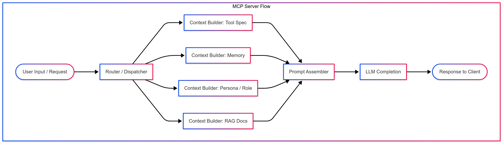

# Chapter 3: Agentic Frameworks Overview

This chapter introduces key frameworks used to build agentic systems, starting from scratch (manual agent construction) and scaling into higher-level abstractions like CrewAI, LangChain, AutoGen, and AgentsSDK.

## Manual Agent Construction (No Framework)

### 📖 What it is:

Using the raw building blocks from an LLM provider (e.g., OpenAI’s `ChatCompletion`, `functions`, `tools`, etc.) to hand-craft agent behavior.

### Example:

```python
from openai import OpenAI
llm = OpenAI(model="gpt-4", tools=[tool_a, tool_b])
response = llm.run("Generate a blog post using tool_a if needed.")
```

### ✅ Pros:

- Full control over logic.
- Minimal dependencies.
- Good for small, embedded use cases.

### ❌ Cons:

- Manual orchestration.
- Difficult to scale or manage complexity.
- No built-in state, memory, retries, planning.

### 🔧 Use Cases:

- Lightweight automations.
- Single-agent flows.
- Tool-assisted completion with clear prompting.

### 🔍 Learn more:

> Anthropic published an article of how to build efficient agents: [https://www.anthropic.com/engineering/building-effective-agents](https://www.anthropic.com/engineering/building-effective-agents)

## CrewAI

### 📖 What it is:

A Pythonic framework focused on team-based agent collaboration. You assign agents roles (e.g., "Researcher", "Writer") and define their tools, goals, and interactions.

### ✅ Pros:

- Clean role-based abstraction.
- Easy to onboard.
- Great for multi-agent delegation and collaboration.
- Supports memory and tools.

### ❌ Cons:

- Less control over fine-grained coordination.
- Less composability for very custom flows.

### 🔧 Use Cases:

- Multi-agent "teams" (Writer + Critic + Editor)
- Startup-like autonomous workflows
- Report generation, planning, product ideation

### 🔍 Learn more

- Link: [https://www.crewai.com](https://www.crewai.com)
- Docs: [https://docs.crewai.com](https://docs.crewai.com)

> Note: CrewAI published an article of how to create efficient agents: [https://docs.crewai.com/guides/agents/crafting-effective-agents](https://docs.crewai.com/guides/agents/crafting-effective-agents)

## LangChain Agents

### 📖 What it is:

LangChain provides an agent abstraction that can plan tool use, chain outputs, and manage memory/state. More modular, but more verbose.

### ✅ Pros:

- Flexible + customizable with toolkits and chains.
- Huge ecosystem.
- Strong RAG + memory support.

### ❌ Cons:

- Can get complex quickly.
- Steeper learning curve.
- Slower dev feedback loop.

### 🔧 Use Cases:

- Enterprise-level agent pipelines.
- Custom planners, retrievers, dynamic execution.
- Graph-based agent workflows (LangGraph).

### 🔍 Learn more

- Link: [https://python.langchain.com](https://python.langchain.com).
- API Reference: [https://python.langchain.com/docs/introduction/#api-reference](https://python.langchain.com/docs/introduction/#api-reference).

## AutoGen

### 📖 What it is:

Multi-agent orchestration where agents send messages to each other. Inspired by LLMs as message-passing entities (think: Autogen loop, group chat coordination).

### ✅ Pros:

- Powerful agent-to-agent design.
- Good for planning + critique loops.
- Supports human-in-the-loop and dynamic conversation.

### ❌ Cons:

- Overhead of conversation scaffolding.
- Less intuitive than prompt-chaining agents.
- Heavier dependency stack.

### 🔧 Use Cases:

- Self-improving agents (reflection, optimization).
- Developer agents (e.g., code generation + review).
- Tool-enhanced chat flows.

### 🔍 Learn more

- Link: [https://microsoft.github.io/autogen/stable/index.html](https://microsoft.github.io/autogen/stable/index.html).

## AgentsSDK (OpenAI Function Agent SDK)

### 📖 What it is:

OpenAI's evolving SDK to define agents declaratively using native tool/function interfaces, workflows, and OpenAI-specific orchestration.

### ✅ Pros:

- Native integration with OpenAI's function calling
- Declarative flows
- High performance and tight integration

### ❌ Cons:

- Locked into OpenAI ecosystem.
- Less flexibility for external tools or models.
- Early-stage / evolving quickly.

### 🔧 Use Cases:

- High-efficiency OpenAI-native agents.
- Serverless task automation.
- Declarative business agents.

### 🔍 Learn more

- Link: [https://openai.github.io/openai-agents-python](https://openai.github.io/openai-agents-python).

## MCP/Model Context Protocol Server (Multi-Context Prompting)

### 📖 What it is:

MCP is a server-based architecture that delivers contextual payloads to a single LLM (or orchestrated agents).
It's often used to:

- Route user input to different **context builders** (e.g. tool specs, memory, structured data).
- Dynamically construct **rich prompts** with context modules.
- Return responses through a stateless, declarative API.

While not a framework like CrewAI or AutoGen, it’s a powerful backend strategy for building highly modular LLM workflows.

> Think of MCP as a REST API for agentic systems - a structured way to expose context slices (data, tools, policies) to an LLM dynamically through routing, planning, and modular context construction.

## Diagram



### ✅ Pros:

- Modular + composable prompt context system
- Stateless API — decouples the LLM logic from app infrastructure
- Easily testable and extensible
- Works with any **LLM backend** (OpenAI, Claude, etc.)
- Can dynamically swap in context providers (e.g., tool specs, memory slices, roles)

### ❌ Cons:

- You still need to implement reasoning, feedback loops, etc.
- Not truly autonomous — requires an external "driver".
- No agent-level memory or long-term reflection unless added.
- Can become complex if too many dynamic contexts.

### 🔧 Use Cases:

- **Agentic backend layer**: Route different business workflows to custom prompt builders.
- **Human-in-the-loop dashboards**: Let users guide LLMs with pre-baked context modules (e.g. personas, RAG, toolkits).
- **Unified agent gateway**: Build an abstraction where LLM agents access tools, memory, and history via modular prompts.
- **Policy enforcement**: Inject compliance or behavioral guidelines depending on route/user.

### 🔍 Learn More

- FastMCP for Python: [https://github.com/jlowin/fastmcp](https://github.com/jlowin/fastmcp)
- FastMCP for TypeScript: [https://github.com/punkpeye/fastmcp](https://github.com/punkpeye/fastmcp)

## Agentic Framework Comparison Table

| Framework     | Type           | Roles / Agents | Tools | Planning | Memory | Best For                      |
|---------------|----------------|----------------|-------|----------|--------|-------------------------------|
| **Manual**    | Barebones SDK  | ❌              | ✅     | ❌        | ❌      | Small automations, full control |
| **CrewAI**     | Role-based      | ✅              | ✅     | 🟡        | ✅      | Team-style workflows, delegation |
| **LangChain**  | Modular DAG     | ✅              | ✅     | ✅        | ✅      | Complex pipelines, RAG flows   |
| **AutoGen**    | Message-passing | ✅              | ✅     | ✅        | 🟡      | Reflection loops, dev agents   |
| **AgentsSDK**  | Declarative     | ✅              | ✅     | 🟡        | ❌      | OpenAI-native automations      |
| **MCP Server** | Context API     | External driver| ✅     | External | External| Modular prompts, backend logic |
