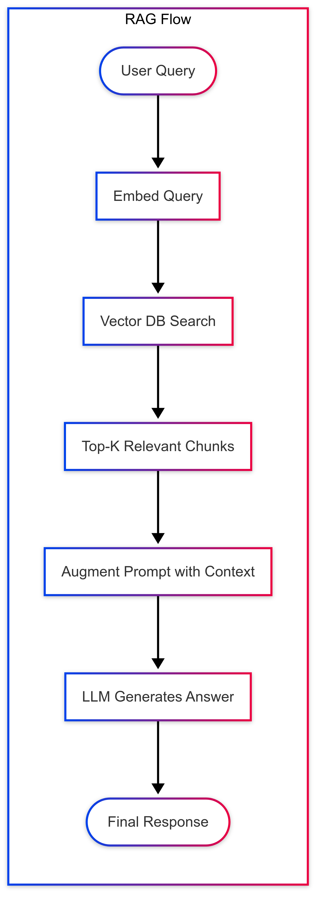

# Chapter 4: RAG (Retrieval-Augmented Generation) Overview

**RAG (Retrieval-Augmented Generation)** is an architecture that combines a retriever (typically using a vector database) with a generator (an LLM like GPT-4).

> Instead of asking the LLM to answer based only on its training data, you inject fresh, external context into the prompt — retrieved in real-time from your own data sources.

## 🔧 How It Works (Step-by-Step)

1. **User Input (Query)**

   - → "How do I configure the analytics connector?"

2. **Retriever Step (Search)**

   - Convert the query into a vector embedding (a list of ~768–1536 float numbers).
   - Search a **vector database** (like Pinecone, Weaviate, Chroma, FAISS) to find **semantically similar** documents, FAQs, or snippets.
   - Result: Top N chunks of relevant text (e.g., from your docs or KB).

3. **Augmentation Step**

   - Inject those retrieved text chunks into the prompt for the LLM:

```markdown
Context:
- "To configure the analytics connector, first..."
- "Make sure you set the token in your project settings..."

Question: How do I configure the analytics connector?
```

4. **Generation Step (LLM)**

   - The LLM answers based on both the query and the retrieved context, not just its internal weights.

## Diagram



## 🎯 Why Use RAG?

- Keeps your LLM **up-to-date** without retraining.
- Allows referencing **private/internal documents**.
- Improves factual accuracy (less hallucination).
- Gives you **control** over the source of truth.

